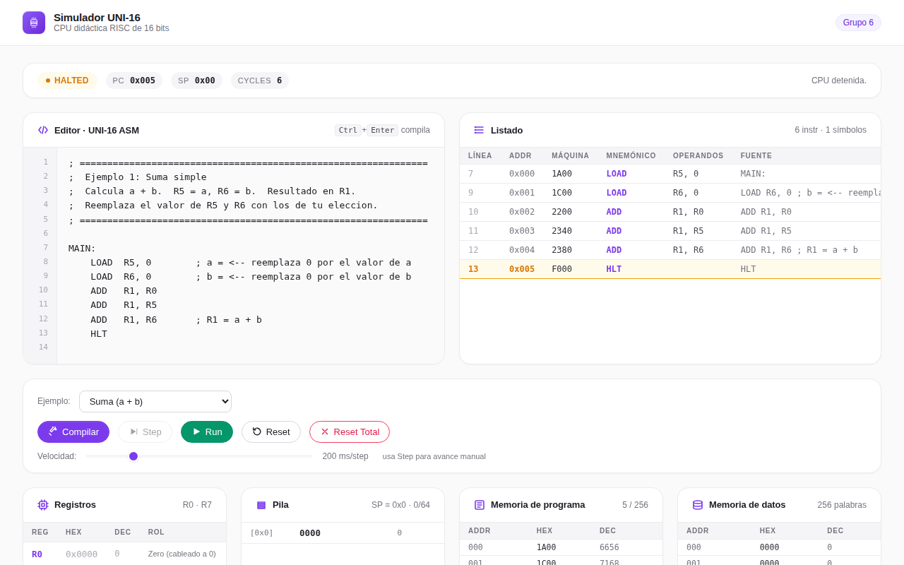

# Simulador UNI-16

Simulador didactico de la CPU UNI-16, una arquitectura RISC de 16 bits disenada para el curso de Arquitectura de Computadoras II de la Universidad Nacional de Ingenieria (UNI).


## Captura del simulador)




## Sobre el proyecto

Un simulador visual e interactivo de una CPU RISC de 16 bits, con ISA propia (LOAD, ADD, SUB, AND, OR, XOR, LW, SW, BEQ, BNE, SUBI, J, PUSH, POP, HLT). Incluye editor de ensamblador, ensamblador propio, ejecucion paso a paso o completa, y visualizacion en vivo de registros, pila, memoria de programa y memoria de datos.

## Stack tecnico

React + TypeScript + Vite, con la logica de CPU y ensamblador desacoplada de la interfaz (carpeta src/core) y estado global via useReducer. Tests unitarios con Vitest.

## Como correrlo

```bash
git clone https://github.com/RichardEsteban/TrabajoFinalArquitectura_II.git
cd TrabajoFinalArquitectura_II/Simulador_Uni16
npm install
npm run dev
```

Luego abre http://localhost:5173/. Otros comandos: npm run build, npm run preview, npm run test.

## Estado

Funcional y verificado: se instalo, compilo y ejecuto de punta a punta sin errores. Es de los proyectos mas solidos y didacticos del portafolio.

---

Desarrollado por Richard Esteban
